<p align="center">
  
</p>

<h1 align="center">🔬 RRI — Research & Repository Intelligence</h1>

<p align="center">
  <em>A personalized research intelligence platform that helps researchers discover, organize, and interact with academic papers & repositories using AI-powered chat, semantic search, and automated trend analysis.</em>
</p>

<p align="center">
  <a href="#-features"></a>
  <a href="#-tech-stack"></a>
  <a href="#-tech-stack"></a>
  <a href="#-tech-stack"></a>
  <a href="#-tech-stack"></a>
  <a href="LICENSE"></a>
</p>

<p align="center">
  <a href="#-quick-start">Quick Start</a> •
  <a href="#-features">Features</a> •
  <a href="#-screenshots">Screenshots</a> •
  <a href="docs/CLI.md">CLI Tool</a> •
  <a href="docs/API.md">API Reference</a> •
  <a href="docs/ARCHITECTURE.md">Architecture</a> •
  <a href="CONTRIBUTING.md">Contributing</a>
</p>

---

## 📖 Overview

**RRI (Research & Repository Intelligence)** is a full-stack, self-hosted platform designed for researchers, engineers, and teams who want to **automate the discovery and analysis** of academic papers, open-source repositories, and AI/ML community discussions — all in one place.

RRI continuously collects data from **11+ sources**, processes it with NLP pipelines, indexes everything into a **vector database** for semantic search, and provides an **AI chat interface** (RAG) so you can ask questions about your research corpus in natural language.

### 🎯 Who is RRI for?

| Audience | Use Case |
|:---------|:---------|
| 🎓 **Researchers** | Track new papers in your field, discover related work, get AI-generated summaries |
| 👩‍💻 **ML Engineers** | Monitor trending GitHub repos, HuggingFace models, and community discussions |
| 🏢 **Research Teams** | Centralized knowledge base with document chat, bookmarks, and weekly digests |
| 📊 **Tech Leads** | Tech radar, trend analysis, and automated intelligence reports |

### ⚡ Key Highlights

<table>
<tr>
<td width="50%">

🔎 **Semantic Search** across 10,000+ papers & repos with vector similarity

</td>
<td width="50%">

🤖 **Chat with your documents** — upload PDFs, DOCX, or ingest GitHub repos

</td>
</tr>
<tr>
<td width="50%">

📡 **Auto-collect** from 11+ sources (ArXiv, GitHub, HuggingFace, OpenReview...)

</td>
<td width="50%">

💻 **Built-in CLI** — run OSINT tasks directly from the terminal

</td>
</tr>
<tr>
<td width="50%">

📊 **Trending & Analytics** — Tech Radar, trend charts, community insights

</td>
<td width="50%">

📚 **Personal Library** — bookmarks, folders, weekly research digests

</td>
</tr>
</table>

---

## ✨ Features

### 📄 Multi-Source Data Collection

RRI automatically collects and aggregates data from **11+ academic and developer sources**:

| Source | Type | Data Collected |
|:-------|:-----|:---------------|
| 🔬 **ArXiv** | Papers | Pre-prints with abstracts, categories, authors |
| 📚 **Semantic Scholar** | Papers | Citations, references, influence scores |
| 🌐 **OpenAlex** | Papers | Open-access metadata, concepts, institutions |
| 💻 **Papers With Code** | Papers + Code | Paper-code links, benchmarks, tasks |
| 🐙 **GitHub** | Repositories | Stars, forks, languages, topics, README |
| 🤗 **HuggingFace** | Models + Papers | Model cards, downloads, daily papers |
| 📝 **OpenReview** | Peer Reviews | ICLR/NeurIPS reviews, ratings, decisions |
| 🟠 **Hacker News** | Discussions | AI/ML posts, scores, comments |
| ✍️ **Dev.to** | Blog Posts | Technical articles, tags, reactions |
| 🐘 **Mastodon** | Social Posts | Research community discussions |
| 🔗 **Lemmy** | Forum Posts | Federated community discussions |

### 🔍 Semantic Search

- **Vector-based search** powered by [Qdrant](https://qdrant.tech/) and [BGE embeddings](https://huggingface.co/BAAI/bge-base-en-v1.5)
- Search across **papers and repositories** simultaneously
- Relevance scoring with percentage match display
- Filter results by type (Papers / Repos / All)

### 🤖 AI-Powered Chat (RAG)

- **Retrieval-Augmented Generation** pipeline with context-aware answers
- Dual LLM support: **Ollama** (local, private) + **OpenAI GPT-4o** (cloud)
- **Document Chat**: Upload PDFs, DOCX, PPTX → ask questions about your documents
- **Repo Ingestion**: Ingest entire GitHub repositories via [gitingest](https://github.com/cyclotruc/gitingest) → chat about code
- Full context mode vs. RAG retrieval mode per conversation
- Conversation history with multi-turn support

### 📊 Analytics & Trending

- **Papers Overview**: Category distribution (donut chart), yearly publication trends (bar chart)
- **Trending Papers & Repos**: Filterable by period (day/week/month), category, language
- **Tech Radar**: Auto-generated technology trend analysis
- **HuggingFace Dashboard**: Model rankings, download stats, task distribution
- **Community Keywords**: Trending topics across platforms with keyword analysis

### 📋 Knowledge Management

- **Bookmarks & Folders**: Organize papers and repos into custom folders
- **My Library**: Personal document collection with folder tree
- **Weekly Reports**: Auto-generated research digest summaries
- **Paper-Code Linking**: Automatically match papers to their implementations
- **Citation Enrichment**: Bulk update citation counts from Semantic Scholar

### 🔐 Authentication & Multi-User

- JWT-based authentication with user registration/login
- Per-user document libraries, bookmarks, and conversations
- Role-based access to AI chat features

### 🌙 Modern UI/UX

- **Dark/Light theme** toggle with smooth transitions
- **Responsive design** with glassmorphism effects and micro-animations
- **Interactive charts** built with Recharts
- **Knowledge graph** visualization with react-force-graph-2d
- Global search bar with keyboard shortcut (`/`)

### 💻 CLI Tool

RRI includes a built-in CLI for running OSINT tasks from the terminal. See the [full CLI documentation](docs/CLI.md).

```bash
rri collect arxiv --query "LLM" --category cs.AI --max-results 100
rri search vector "multi-modal RAG" --limit 10
rri analyze paper 2401.12345 --cloud
rri export report --period weekly --format md
rri chat   # Interactive RAG chat
```

---

## 📸 Screenshots

### Landing Page


### Dashboard

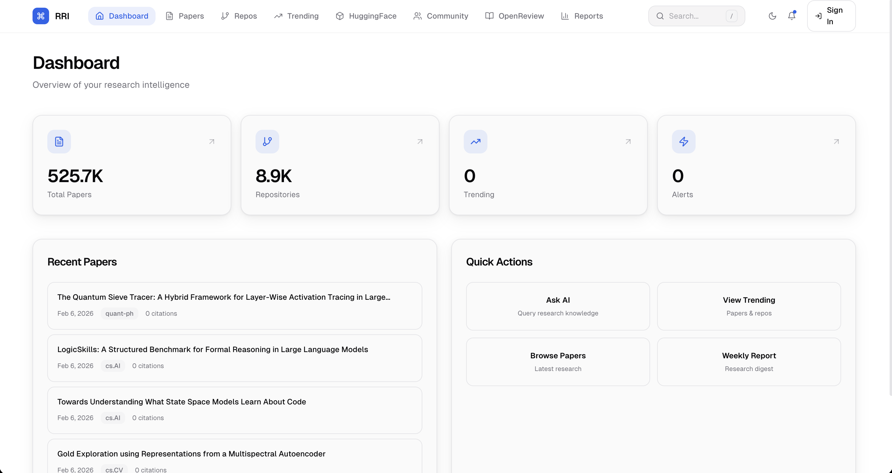

### Papers — Overview & Analytics

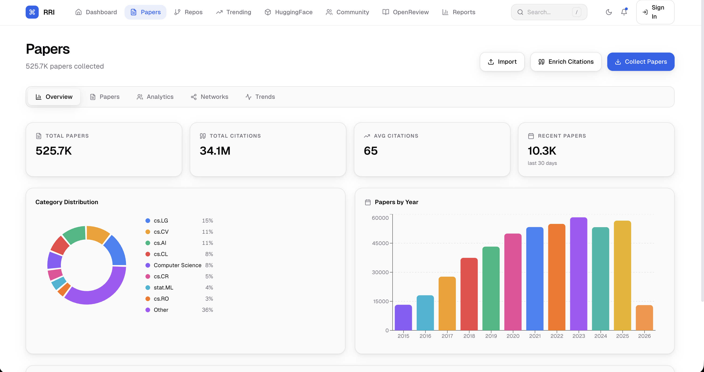

### Papers — Browse & Filter

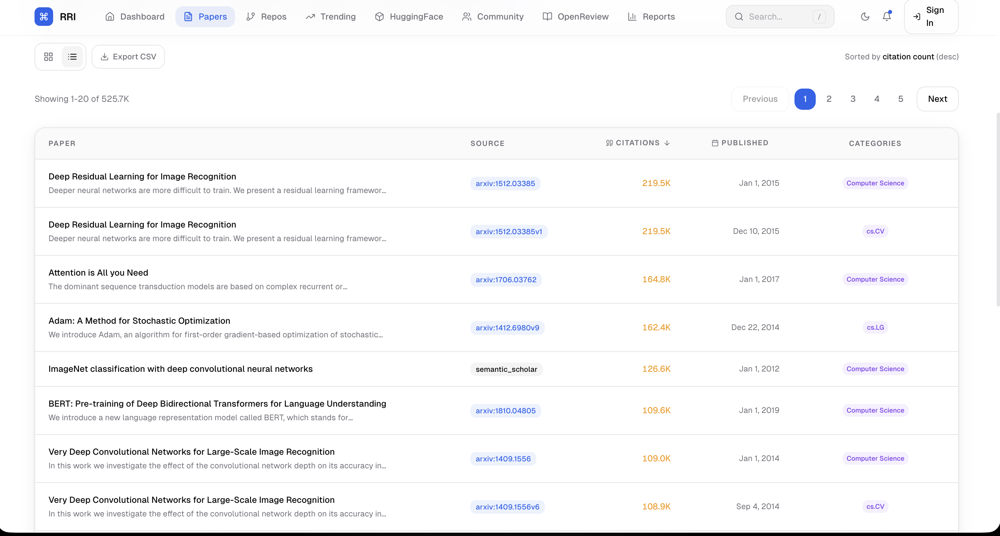

### Semantic Search

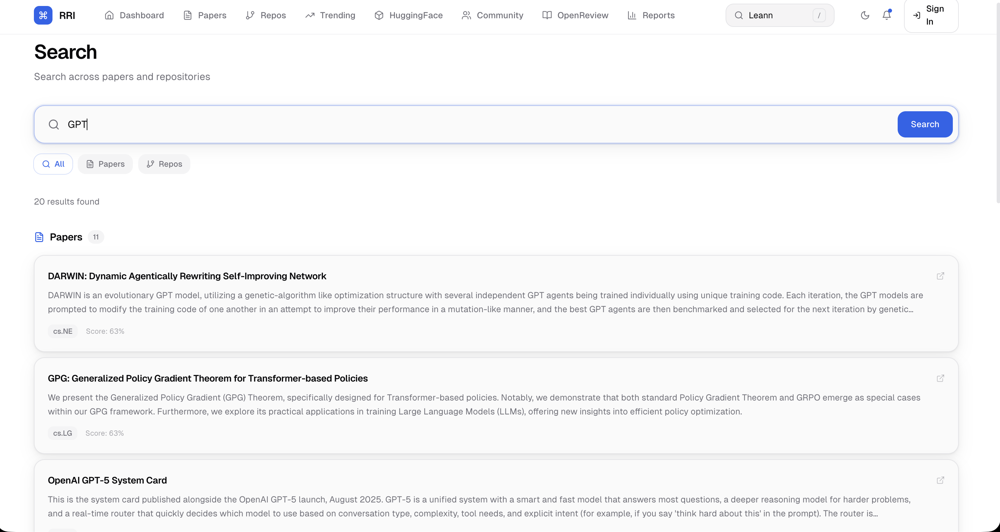

### AI Chat (RAG)

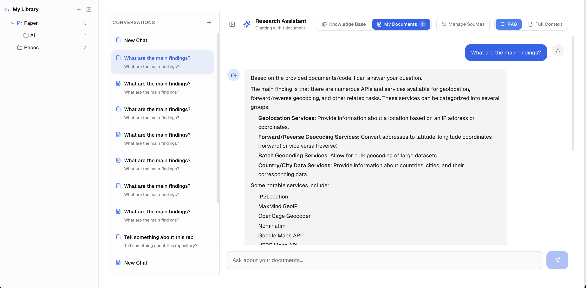

### Trending

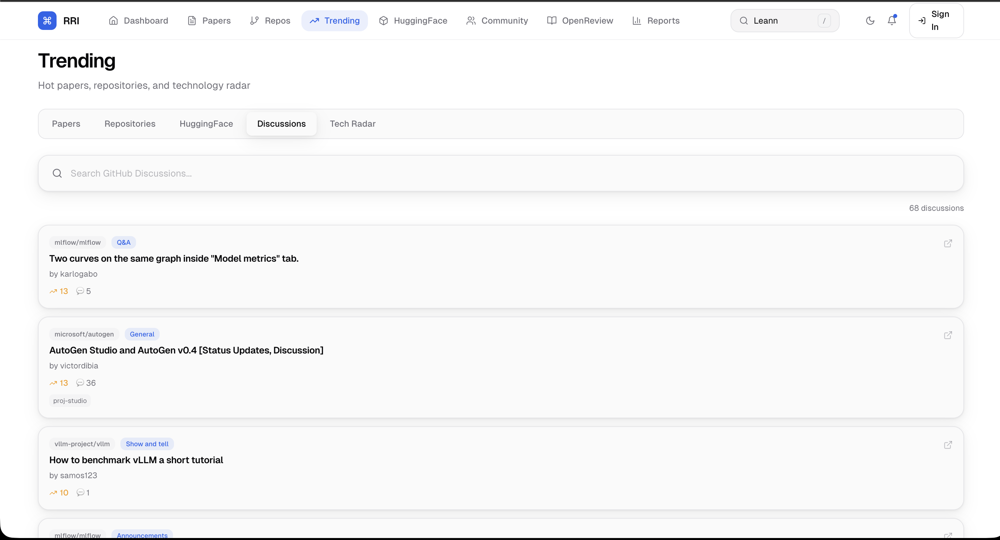

### Community & OpenReview

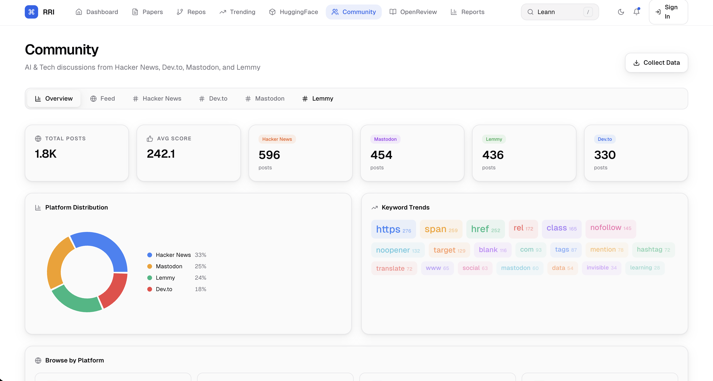

### HuggingFace Models

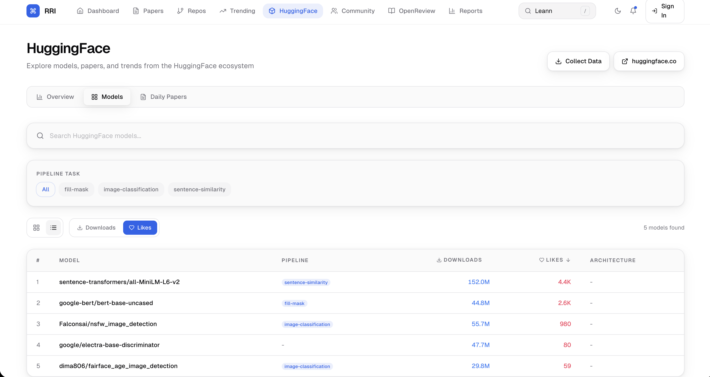

### Repositories

<!-- 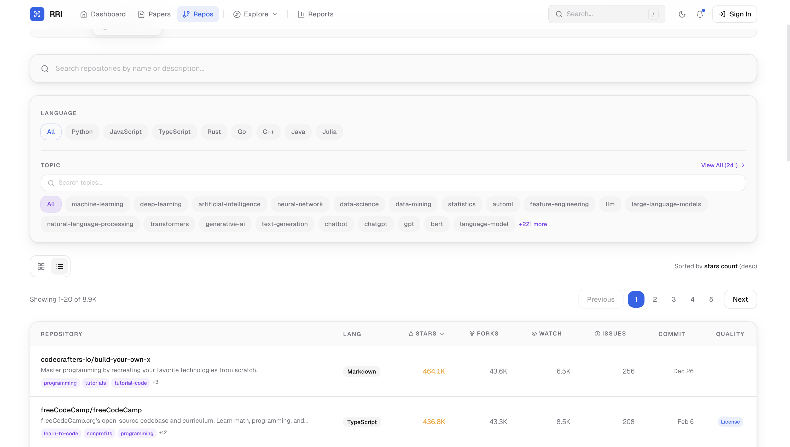 -->
> 📸 *Chụp ảnh trang `/repos` và lưu vào `docs/screenshots/repos.png`*

### Paper Detail

<!-- 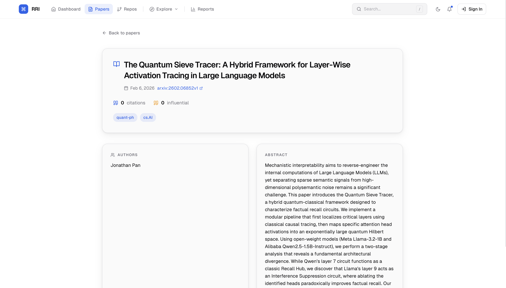 -->
> 📸 *Chụp ảnh trang `/papers/[id]` và lưu vào `docs/screenshots/paper-detail.png`*

### OpenReview

<!-- 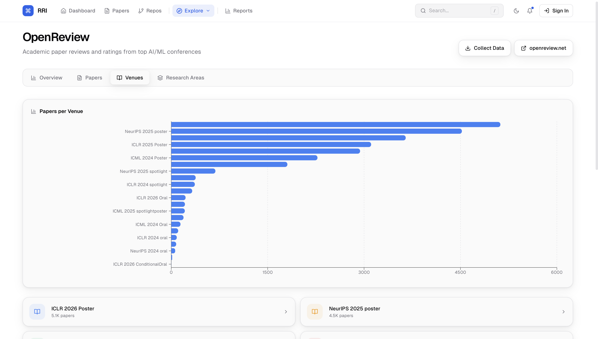 -->
> 📸 *Chụp ảnh trang `/openreview` và lưu vào `docs/screenshots/openreview.png`*

### My Library

<!-- 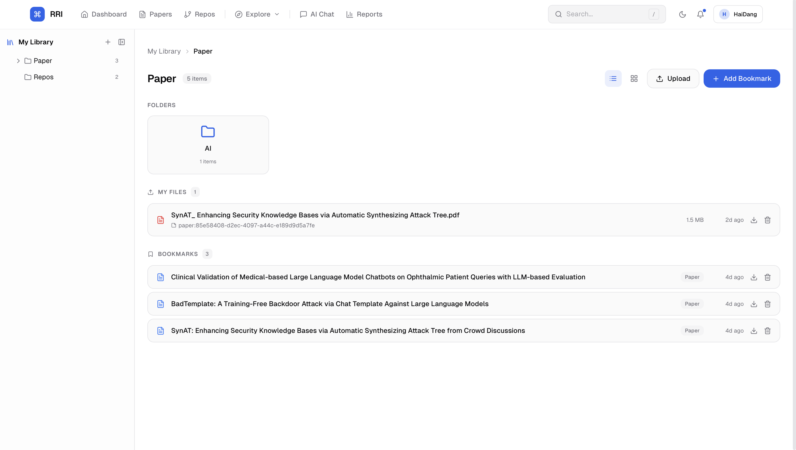 -->
> 📸 *Chụp ảnh trang `/my-library` và lưu vào `docs/screenshots/my-library.png`*

### Weekly Reports

<!--  -->
> 📸 *Chụp ảnh trang `/reports` và lưu vào `docs/screenshots/reports.png`*

---

## 🛠 Tech Stack

### Backend
| Technology | Purpose |
|:-----------|:--------|
| [FastAPI](https://fastapi.tiangolo.com/) | Async REST API framework |
| [SQLAlchemy 2.0](https://www.sqlalchemy.org/) | Async ORM with PostgreSQL |
| [Celery](https://docs.celeryq.dev/) | Distributed task queue |
| [Qdrant](https://qdrant.tech/) | Vector similarity search engine |
| [Sentence Transformers](https://www.sbert.net/) | BGE text embeddings |
| [Ollama](https://ollama.com/) | Local LLM inference (Llama 3) |
| [OpenAI API](https://platform.openai.com/) | Cloud LLM (GPT-4o) |
| [Alembic](https://alembic.sqlalchemy.org/) | Database migrations |
| [Pydantic v2](https://docs.pydantic.dev/) | Data validation & settings |

### Frontend
| Technology | Purpose |
|:-----------|:--------|
| [Next.js 14](https://nextjs.org/) | React framework (App Router) |
| [TypeScript](https://www.typescriptlang.org/) | Type-safe JavaScript |
| [TailwindCSS](https://tailwindcss.com/) | Utility-first styling |
| [Recharts](https://recharts.org/) | Data visualization charts |
| [react-force-graph-2d](https://github.com/vasturiano/react-force-graph) | Knowledge graph visualization |
| [Lucide React](https://lucide.dev/) | Icon library |
| [Axios](https://axios-http.com/) | HTTP client |

### Infrastructure
| Technology | Purpose |
|:-----------|:--------|
| [Docker Compose](https://docs.docker.com/compose/) | Multi-container orchestration |
| [PostgreSQL 16](https://www.postgresql.org/) | Relational database |
| [Redis 7](https://redis.io/) | Caching & Celery message broker |
| [Qdrant](https://qdrant.tech/) | Vector embeddings storage |
| [Ollama](https://ollama.com/) | Self-hosted LLM runtime |

---

## 🚀 Quick Start

### Prerequisites

- **Docker** & **Docker Compose** (v2.0+)
- **Git**
- *(Optional)* GitHub Personal Access Token for higher API rate limits
- *(Optional)* OpenAI API key for cloud LLM features

### 1. Clone & Configure

```bash
git clone https://github.com/nhdandz/ResearchRover.git
cd ResearchRover
cp .env.example .env
# Edit .env with your API keys
```

### 2. Start All Services

```bash
make up
```

This launches **8 containers**: app, worker, beat, postgres, redis, qdrant, ollama, frontend.

### 3. Initialize

```bash
make migrate          # Run database migrations
make pull-model       # Download Ollama LLM model
make seed             # (Optional) Seed demo data
```

### 4. Access

| Service | URL |
|:--------|:----|
| 🌐 **Frontend** | [http://localhost:3000](http://localhost:3000) |
| ⚡ **Backend API** | [http://localhost:8000](http://localhost:8000) |
| 📖 **API Docs** | [http://localhost:8000/docs](http://localhost:8000/docs) |
| 🔍 **Qdrant** | [http://localhost:6333/dashboard](http://localhost:6333/dashboard) |

> 📚 For detailed setup, environment variables, and local development: see [Configuration Guide](docs/CONFIGURATION.md)

---

## 🗺 Roadmap

- [ ] 🔔 Real-time alerting with email/Slack notifications
- [ ] 📈 Advanced trend analysis with time-series visualization
- [ ] 🌍 Multi-language support (Vietnamese paper sources already integrated)
- [ ] 📱 Mobile-responsive PWA
- [ ] 🔗 BibTeX export and Zotero integration
- [ ] 🧩 Plugin system for custom data sources
- [ ] 📊 Comparative analysis dashboards
- [ ] 🤝 Team collaboration features

---

## 📚 Documentation

| Document | Description |
|:---------|:------------|
| [CLI Tool](docs/CLI.md) | Full CLI reference with all commands and options |
| [API Reference](docs/API.md) | REST API endpoints, authentication, examples |
| [Architecture](docs/ARCHITECTURE.md) | System design, data pipeline, project structure |
| [Configuration](docs/CONFIGURATION.md) | Environment variables, local dev setup, testing |
| [Deployment](docs/DEPLOYMENT.md) | Docker deployment, Cloudflare Tunnel, VPS guide |
| [Contributing](CONTRIBUTING.md) | How to contribute, code style, PR process |

---

## 📄 License

This project is licensed under the **MIT License** — see the [LICENSE](LICENSE) file for details.

---

<p align="center">
  <strong>Built with ❤️ for the research community</strong>
  <br />
  <sub>If you find RRI useful, consider giving it a ⭐ on GitHub!</sub>
</p>
