<p align="center">
  
</p>

<h1 align="center">🔬 RRI — Research & Repository Intelligence</h1>

<p align="center">
  <em>An AI-powered OSINT platform for automated research paper discovery, GitHub repository tracking, and intelligent knowledge management.</em>
</p>

<p align="center">
  <a href="#-features"></a>
  <a href="#-tech-stack"></a>
  <a href="#-tech-stack"></a>
  <a href="#-tech-stack"></a>
  <a href="#-tech-stack"></a>
  <a href="LICENSE"></a>
</p>

<p align="center">
  <a href="#-quick-start">Quick Start</a> •
  <a href="#-features">Features</a> •
  <a href="#-architecture">Architecture</a> •
  <a href="#-cli-tool">CLI Tool</a> •
  <a href="#-screenshots">Screenshots</a> •
  <a href="#-api-reference">API Reference</a> •
  <a href="#-contributing">Contributing</a>
</p>

---

## 📖 Overview

**RRI (Research & Repository Intelligence)** is a full-stack, self-hosted platform designed for researchers, engineers, and teams who want to **automate the discovery and analysis** of academic papers, open-source repositories, and AI/ML community discussions — all in one place.

RRI continuously collects data from **11+ sources**, processes it with NLP pipelines, indexes everything into a **vector database** for semantic search, and provides an **AI chat interface** (RAG) so you can ask questions about your research corpus in natural language.

### 🎯 Who is RRI for?

| Audience | Use Case |
|:---------|:---------|
| 🎓 **Researchers** | Track new papers in your field, discover related work, get AI-generated summaries |
| 👩‍💻 **ML Engineers** | Monitor trending GitHub repos, HuggingFace models, and community discussions |
| 🏢 **Research Teams** | Centralized knowledge base with document chat, bookmarks, and weekly digests |
| 📊 **Tech Leads** | Tech radar, trend analysis, and automated intelligence reports |

---

## ✨ Features

### 📄 Multi-Source Data Collection

RRI automatically collects and aggregates data from **11+ academic and developer sources**:

| Source | Type | Data Collected |
|:-------|:-----|:---------------|
| 🔬 **ArXiv** | Papers | Pre-prints with abstracts, categories, authors |
| 📚 **Semantic Scholar** | Papers | Citations, references, influence scores |
| 🌐 **OpenAlex** | Papers | Open-access metadata, concepts, institutions |
| 💻 **Papers With Code** | Papers + Code | Paper-code links, benchmarks, tasks |
| 🐙 **GitHub** | Repositories | Stars, forks, languages, topics, README |
| 🤗 **HuggingFace** | Models + Papers | Model cards, downloads, daily papers |
| 📝 **OpenReview** | Peer Reviews | ICLR/NeurIPS reviews, ratings, decisions |
| 🟠 **Hacker News** | Discussions | AI/ML posts, scores, comments |
| ✍️ **Dev.to** | Blog Posts | Technical articles, tags, reactions |
| 🐘 **Mastodon** | Social Posts | Research community discussions |
| 🔗 **Lemmy** | Forum Posts | Federated community discussions |

### 🔍 Semantic Search

- **Vector-based search** powered by [Qdrant](https://qdrant.tech/) and [BGE embeddings](https://huggingface.co/BAAI/bge-base-en-v1.5)
- Search across **papers and repositories** simultaneously
- Relevance scoring with percentage match display
- Filter results by type (Papers / Repos / All)

### 🤖 AI-Powered Chat (RAG)

- **Retrieval-Augmented Generation** pipeline with context-aware answers
- Dual LLM support: **Ollama** (local, private) + **OpenAI GPT-4o** (cloud)
- **Document Chat**: Upload PDFs, DOCX, PPTX → ask questions about your documents
- **Repo Ingestion**: Ingest entire GitHub repositories via [gitingest](https://github.com/cyclotruc/gitingest) → chat about code
- Full context mode vs. RAG retrieval mode per conversation
- Conversation history with multi-turn support

### 📊 Analytics & Trending

- **Papers Overview**: Category distribution (donut chart), yearly publication trends (bar chart)
- **Trending Papers & Repos**: Filterable by period (day/week/month), category, language
- **Tech Radar**: Auto-generated technology trend analysis
- **HuggingFace Dashboard**: Model rankings, download stats, task distribution
- **Community Keywords**: Trending topics across platforms with keyword analysis

### 📋 Knowledge Management

- **Bookmarks & Folders**: Organize papers and repos into custom folders
- **My Library**: Personal document collection with folder tree
- **Weekly Reports**: Auto-generated research digest summaries
- **Paper-Code Linking**: Automatically match papers to their implementations
- **Citation Enrichment**: Bulk update citation counts from Semantic Scholar

### 🔐 Authentication & Multi-User

- JWT-based authentication with user registration/login
- Per-user document libraries, bookmarks, and conversations
- Role-based access to AI chat features

### 🌙 Modern UI/UX

- **Dark/Light theme** toggle with smooth transitions
- **Responsive design** with glassmorphism effects and micro-animations
- **Interactive charts** built with Recharts
- **Knowledge graph** visualization with react-force-graph-2d
- Global search bar with keyboard shortcut (`/`)

---

## 🏗 Architecture

```
┌────────────────────────────────────────────────────────────────────────┐
│                           FRONTEND (Next.js 14)                        │
│  Dashboard │ Papers │ Repos │ Search │ Trending │ Community │ AI Chat  │
└──────────────────────────────┬─────────────────────────────────────────┘
                               │ REST API
┌──────────────────────────────┴─────────────────────────────────────────┐
│                          BACKEND (FastAPI)                             │
│                                                                        │
│  ┌──────────┐  ┌───────────┐  ┌────────--─┐  ┌──────────┐  ┌─────────┐ │
│  │  API     │  │ Collectors│  │Processors │  │   LLM    │  │   RAG   │ │
│  │ Routers  │  │           │  │           │  │  Router  │  │Pipeline │ │
│  │ (15)     │  │ ArXiv     │  │Embedding  │  │          │  │         │ │
│  │          │  │ GitHub    │  │Classifier │  │  Ollama  │  │Retriever│ │
│  │ Papers   │  │ Semantic  │  │Summarizer │  │  OpenAI  │  │Reranker │ │
│  │ Repos    │  │ Scholar   │  │Entity     │  │          │  │Generator│ │
│  │ Search   │  │ OpenAlex  │  │Extractor  │  └──────────┘  └─────────┘ │
│  │ Trending │  │ PwC       │  │PaperCode  │                            │
│  │ Chat     │  │ HF        │  │Linker     │                            │
│  │ Docs     │  │ OpenReview│  │TechRadar  │                            │
│  │ Community│  │ HN/Dev.to │  │Trending   │                            │
│  │ Reports  │  │ Mastodon  │  │Analyzer   │                            │
│  │ Auth     │  │ Lemmy     │  │           │                            │
│  │ Bookmarks│  │           │  │           │                            │
│  └──────────┘  └───────────┘  └───────-───┘                            │
│                                                                        │
│  ┌─────────────────────────────────────────────────────────────────┐   │
│  │                    WORKER LAYER (Celery + Redis)                │   │
│  │  • Periodic data collection    • Embedding generation           │   │
│  │  • Citation enrichment         • Report generation              │   │
│  └─────────────────────────────────────────────────────────────────┘   │
└────────────────────────────────────────────────────────────────────────┘
                               │
        ┌──────────────────────┼──────────────────────┐
        │                      │                      │
┌───────┴──────┐  ┌────────────┴──────────┐  ┌───────┴──────┐
│  PostgreSQL  │  │     Qdrant            │  │    Redis     │
│  (Relational │  │  (Vector Database)    │  │   (Cache &   │
│   Storage)   │  │  Papers + Repos +     │  │  Task Queue) │
│              │  │  Documents embeddings │  │              │
└──────────────┘  └───────────────────────┘  └──────────────┘
```

---

## 💻 CLI Tool

RRI includes a built-in CLI (`rri`) for running OSINT tasks directly from the terminal — no browser needed.

### Usage

#### Docker (Recommended)

Since the project runs via Docker, use `docker exec` to run CLI commands:

```bash
# Show help
docker exec rri-app-1 rri --help

# Shorthand: create an alias (add to your ~/.zshrc or ~/.bashrc)
alias rri='docker exec rri-app-1 rri'

# Then use directly
rri collect arxiv --query "LLM" --max-results 10
```

> **Note:** For interactive commands like `rri chat`, you **must** use the `-it` flag:
> ```bash
> docker exec -it rri-app-1 rri chat
> ```

#### Local (without Docker)

If you have the project installed locally with a virtual environment:

```bash
source .venv/bin/activate
pip install -e .
rri --help
```

> When running locally, RRI automatically detects it's outside Docker and converts internal hostnames (ollama, postgres, qdrant, redis) to `localhost`, so it connects to Docker services via exposed ports.

### Available Commands

```
rri collect   Collect papers, models, and repos from various sources
rri search    Search papers, vectors, and repos
rri analyze   Analyze papers with LLM
rri export    Export reports and data
rri chat      Interactive RAG-powered chat (REPL)
```

### `rri collect` — Data Collection

```bash
# Collect papers from ArXiv
rri collect arxiv --query "LLM" --category cs.AI --days 7 --max-results 100

# Collect papers from OpenAlex
rri collect openalex --query "transformer" --from-year 2024 --max-results 50

# Collect models from HuggingFace
rri collect huggingface --query "llm" --type models --max-results 20

# Collect datasets from HuggingFace
rri collect huggingface --query "instruction" --type datasets --max-results 20

# Ingest a GitHub repository
rri collect repo https://github.com/user/repo
```

<details>
<summary>Docker equivalent</summary>

```bash
docker exec rri-app-1 rri collect arxiv --query "LLM" --category cs.AI --days 7 --max-results 100
docker exec rri-app-1 rri collect openalex --query "transformer" --from-year 2024 --max-results 50
docker exec rri-app-1 rri collect huggingface --query "llm" --type models --max-results 20
docker exec rri-app-1 rri collect repo https://github.com/user/repo
```
</details>

**Options:**
- `--save-db` — Save collected data to database (default: off for ArXiv)
- `--output PATH` — Custom output directory (default: `./reports/`)

### `rri search` — Search

```bash
# Search papers in database (full-text)
rri search papers "attention mechanism" --limit 20 --sort-by citations

# Semantic vector search across papers
rri search vector "multi-modal RAG pipeline" --limit 10 --collection papers

# Search repositories
rri search repos "llm inference" --limit 10
```

<details>
<summary>Docker equivalent</summary>

```bash
docker exec rri-app-1 rri search papers "attention mechanism" --limit 20 --sort-by citations
docker exec rri-app-1 rri search vector "multi-modal RAG pipeline" --limit 10 --collection papers
docker exec rri-app-1 rri search repos "llm inference" --limit 10
```
</details>

### `rri analyze` — LLM-Powered Analysis

```bash
# Analyze a single paper by ArXiv ID (uses local Ollama by default)
rri analyze paper 2401.12345

# Analyze with cloud LLM (OpenAI) and save to database
rri analyze paper 2401.12345 --cloud --save-db

# Batch analyze papers matching a query
rri analyze batch "LLM reasoning" --max-results 10 --category cs.AI
```

<details>
<summary>Docker equivalent</summary>

```bash
docker exec rri-app-1 rri analyze paper 2401.12345
docker exec rri-app-1 rri analyze paper 2401.12345 --cloud --save-db
docker exec rri-app-1 rri analyze batch "LLM reasoning" --max-results 10 --category cs.AI
```
</details>

Each analysis produces: summary, topic classification, keyword extraction, and entity extraction (methods, datasets, metrics, tools). Results are saved as Markdown + JSON in `./reports/`.

### `rri export` — Export Data

```bash
# Generate a weekly research report
rri export report --period weekly --format md

# Export papers as CSV
rri export papers --query "LLM" --limit 50 --format csv

# Export papers as JSON or Markdown
rri export papers --query "transformer" --format json
rri export papers --format md --output ./my-export/papers.md
```

<details>
<summary>Docker equivalent</summary>

```bash
docker exec rri-app-1 rri export report --period weekly --format md
docker exec rri-app-1 rri export papers --query "LLM" --limit 50 --format csv
docker exec rri-app-1 rri export papers --query "transformer" --format json
```
</details>

### `rri chat` — Interactive RAG Chat

```bash
# Start chat with local LLM (Ollama)
rri chat

# Start chat with cloud LLM (OpenAI)
rri chat --cloud

# Disable reranking for faster responses
rri chat --no-rerank

# Search only specific collections
rri chat --collection papers                          # Papers only
rri chat --collection repositories                    # Repos only
rri chat --collection papers --collection repositories # Papers + Repos
```

<details>
<summary>Docker equivalent (requires -it flag)</summary>

```bash
docker exec -it rri-app-1 rri chat
docker exec -it rri-app-1 rri chat --cloud
docker exec -it rri-app-1 rri chat --no-rerank
docker exec -it rri-app-1 rri chat --collection papers
```
</details>

Type your question and press Enter. The system retrieves relevant papers/repos from the vector database and generates answers with citations. Sources are displayed with type icons:

- `[Paper]` — Academic papers (ArXiv, OpenAlex, etc.)
- `[Repo]` — GitHub repositories
- `[Chunk]` — Document chunks from ingested files

Type `quit` to exit.

> **Note:** All output files (JSON, Markdown, CSV) are saved to `./reports/` by default. Use `--output` to specify a custom path.

---

## 📸 Screenshots

### LandingPage


### Dashboard


### Papers — Overview & Analytics


### Papers — Browse & Filter


### Semantic Search


### AI Chat (RAG)


### Trending


### Community & OpenReview


### HuggingFace Models


---

## 🛠 Tech Stack

### Backend
| Technology | Purpose |
|:-----------|:--------|
| [FastAPI](https://fastapi.tiangolo.com/) | Async REST API framework |
| [SQLAlchemy 2.0](https://www.sqlalchemy.org/) | Async ORM with PostgreSQL |
| [Celery](https://docs.celeryq.dev/) | Distributed task queue |
| [Qdrant](https://qdrant.tech/) | Vector similarity search engine |
| [Sentence Transformers](https://www.sbert.net/) | BGE text embeddings |
| [Ollama](https://ollama.com/) | Local LLM inference (Llama 3) |
| [OpenAI API](https://platform.openai.com/) | Cloud LLM (GPT-4o) |
| [Alembic](https://alembic.sqlalchemy.org/) | Database migrations |
| [Pydantic v2](https://docs.pydantic.dev/) | Data validation & settings |

### Frontend
| Technology | Purpose |
|:-----------|:--------|
| [Next.js 14](https://nextjs.org/) | React framework (App Router) |
| [TypeScript](https://www.typescriptlang.org/) | Type-safe JavaScript |
| [TailwindCSS](https://tailwindcss.com/) | Utility-first styling |
| [Recharts](https://recharts.org/) | Data visualization charts |
| [react-force-graph-2d](https://github.com/vasturiano/react-force-graph) | Knowledge graph visualization |
| [Lucide React](https://lucide.dev/) | Icon library |
| [Axios](https://axios-http.com/) | HTTP client |

### Infrastructure
| Technology | Purpose |
|:-----------|:--------|
| [Docker Compose](https://docs.docker.com/compose/) | Multi-container orchestration |
| [PostgreSQL 16](https://www.postgresql.org/) | Relational database |
| [Redis 7](https://redis.io/) | Caching & Celery message broker |
| [Qdrant](https://qdrant.tech/) | Vector embeddings storage |
| [Ollama](https://ollama.com/) | Self-hosted LLM runtime |

---

## 🚀 Quick Start

### Prerequisites

- **Docker** & **Docker Compose** (v2.0+)
- **Git**
- *(Optional)* GitHub Personal Access Token for higher API rate limits
- *(Optional)* OpenAI API key for cloud LLM features

### 1. Clone the Repository

```bash
git clone https://github.com/nhdandz/ResearchRover.git
cd RRI
```

### 2. Configure Environment

```bash
cp .env.example .env
```

Edit `.env` with your API keys:

```env
# Required
GITHUB_TOKEN=ghp_your_github_token

# Optional — improves functionality
SEMANTIC_SCHOLAR_API_KEY=your_key
HUGGINGFACE_TOKEN=hf_your_token
OPENAI_API_KEY=sk-your_key

# LLM Settings
LOCAL_LLM_URL=http://ollama:11434
LOCAL_LLM_MODEL=llama3:8b-instruct-q4_K_M
CLOUD_LLM_MODEL=gpt-4o

# Embedding
EMBEDDING_MODEL=BAAI/bge-base-en-v1.5
```

### 3. Start All Services

```bash
make up
```

This launches **8 containers**: app, worker, beat, postgres, redis, qdrant, ollama, frontend.

### 4. Run Database Migrations

```bash
make migrate
```

### 5. Pull the LLM Model (for local AI Chat)

```bash
make pull-model
```

### 6. (Optional) Seed Initial Data

```bash
make seed
```

### 7. Access the Application

| Service | URL |
|:--------|:----|
| 🌐 **Frontend** | [http://localhost:3000](http://localhost:3000) |
| ⚡ **Backend API** | [http://localhost:8000](http://localhost:8000) |
| 📖 **API Docs (Swagger)** | [http://localhost:8000/docs](http://localhost:8000/docs) |
| 🔍 **Qdrant Dashboard** | [http://localhost:6333/dashboard](http://localhost:6333/dashboard) |

---

## ⚙️ Available Commands

### Make Commands

```bash
make up              # Start all services (docker-compose up -d)
make down            # Stop all services
make logs            # Stream logs from all containers
make migrate         # Run Alembic database migrations
make migrate-create  # Create new migration (msg="description")
make seed            # Seed initial demo data
make init-qdrant     # Initialize Qdrant vector collections
make pull-model      # Download Ollama LLM model
make test            # Run tests with coverage
make lint            # Run ruff linter
make format          # Auto-format code with ruff
```

### CLI via Docker

```bash
docker exec rri-app-1 rri --help                              # Show CLI help
docker exec rri-app-1 rri collect --help                       # Show collect subcommands
docker exec rri-app-1 rri collect arxiv --query "LLM" --max-results 10
docker exec rri-app-1 rri search vector "RAG pipeline" --limit 5
docker exec rri-app-1 rri analyze paper 2401.12345
docker exec rri-app-1 rri export report --period weekly --format md
docker exec -it rri-app-1 rri chat                             # Interactive RAG chat (requires -it)
docker exec -it rri-app-1 rri chat --collection papers         # Chat with papers only
```

---

## 📡 API Reference

RRI exposes a comprehensive REST API with auto-generated [Swagger docs](http://localhost:8000/docs).

### Core Endpoints

| Module | Endpoint | Description |
|:-------|:---------|:------------|
| **Auth** | `POST /auth/register` | User registration |
| | `POST /auth/login` | JWT login |
| **Papers** | `GET /papers/` | List/filter/sort papers |
| | `GET /papers/{id}` | Paper detail with metadata |
| | `GET /papers/stats` | Analytics (category, year distribution) |
| | `POST /papers/collect` | Trigger paper collection job |
| | `POST /papers/enrich-citations` | Enrich citation counts |
| **Repos** | `GET /repos/` | List/filter repositories |
| | `GET /repos/{id}` | Repo detail |
| **Search** | `GET /search/?q=...` | Semantic vector search |
| **Trending** | `GET /trending/papers` | Trending papers by period |
| | `GET /trending/repos` | Trending repos by period |
| | `GET /trending/tech-radar` | Technology trend analysis |
| **HuggingFace** | `GET /trending/hf/models` | HF model rankings |
| | `GET /trending/hf/papers` | Daily HF papers |
| **Community** | `GET /community/posts` | Multi-platform posts |
| | `GET /community/discussions` | GitHub discussions |
| | `GET /community/openreview` | OpenReview papers + reviews |
| **AI Chat** | `POST /chat/` | RAG-powered Q&A |
| | `POST /chat/documents/embed` | Embed documents for chat |
| | `POST /chat/documents/embed-repos` | Ingest GitHub repos |
| **Documents** | `GET /documents/` | User document library |
| | `POST /documents/upload` | Upload PDF/DOCX/PPTX |
| **Bookmarks** | `POST /bookmarks/` | Bookmark papers/repos |
| | `GET /bookmarks/folders` | Folder management |
| **Reports** | `GET /reports/weekly` | Weekly research digest |

---

## 📁 Project Structure

```
RRI/
├── 📂 frontend/                 # Next.js 14 frontend
│   ├── app/                     # App Router pages
│   │   ├── page.tsx             #   Dashboard
│   │   ├── papers/              #   Papers (overview + browse)
│   │   ├── repos/               #   Repositories
│   │   ├── search/              #   Semantic search
│   │   ├── trending/            #   Trending analytics
│   │   ├── huggingface/         #   HuggingFace models
│   │   ├── community/           #   Community posts
│   │   ├── openreview/          #   OpenReview papers
│   │   ├── chat/                #   AI Chat (RAG)
│   │   ├── my-library/          #   Personal library
│   │   ├── reports/             #   Weekly reports
│   │   ├── login/ & register/   #   Authentication
│   │   └── layout.tsx           #   Root layout + TopNav
│   ├── components/              # Reusable components
│   │   ├── layout/TopNav.tsx    #   Navigation bar
│   │   ├── AuthProvider.tsx     #   Auth context
│   │   ├── ThemeProvider.tsx    #   Dark/Light theme
│   │   ├── BookmarkDialog.tsx   #   Bookmark modal
│   │   ├── FileViewerModal.tsx  #   Document viewer
│   │   ├── charts/              #   Chart components
│   │   └── chat/                #   Chat UI components
│   └── lib/                     # API client & utilities
│
├── 📂 src/                      # Python backend
│   ├── main.py                  # FastAPI app factory
│   ├── cli/                     # CLI tool (rri command)
│   │   ├── main.py              #   Typer app entry point
│   │   ├── _async.py            #   Async runner helper
│   │   ├── _context.py          #   Dependency factories
│   │   ├── _output.py           #   Rich formatting & file writers
│   │   └── commands/            #   Command implementations
│   │       ├── collect.py       #     rri collect (arxiv/openalex/hf/repo)
│   │       ├── search.py        #     rri search (papers/vector/repos)
│   │       ├── analyze.py       #     rri analyze (paper/batch)
│   │       ├── export.py        #     rri export (report/papers)
│   │       └── chat.py          #     rri chat (interactive RAG)
│   ├── api/                     # API layer
│   │   ├── routers/             #   15 route modules
│   │   ├── schemas/             #   Pydantic models
│   │   └── deps.py              #   Dependencies (auth, db)
│   ├── collectors/              # Data source collectors
│   │   ├── arxiv.py             #   ArXiv API
│   │   ├── github.py            #   GitHub API
│   │   ├── semantic_scholar.py  #   Semantic Scholar API
│   │   ├── openalex.py          #   OpenAlex API
│   │   ├── papers_with_code.py  #   Papers With Code
│   │   ├── huggingface.py       #   HuggingFace API
│   │   └── vietnam/             #   Vietnamese journal sources
│   ├── processors/              # NLP processing
│   │   ├── embedding.py         #   BGE embedding generation
│   │   ├── classifier.py        #   Paper classification
│   │   ├── summarizer.py        #   Text summarization
│   │   ├── entity_extractor.py  #   Named entity extraction
│   │   ├── paper_code_linker.py #   Paper↔Code matching
│   │   ├── tech_analyzer.py     #   Technology analysis
│   │   └── trending.py          #   Trend computation
│   ├── llm/                     # LLM integration
│   │   ├── router.py            #   LLM router (local/cloud)
│   │   ├── ollama_client.py     #   Ollama client
│   │   ├── openai_client.py     #   OpenAI client
│   │   └── prompts/             #   Prompt templates
│   ├── rag/                     # RAG pipeline
│   │   ├── pipeline.py          #   Main RAG orchestrator
│   │   ├── retriever.py         #   Vector retrieval
│   │   ├── reranker.py          #   Result reranking
│   │   └── generator.py         #   Answer generation
│   ├── services/                # Business logic
│   │   ├── paper_service.py     #   Paper operations
│   │   ├── repo_service.py      #   Repository operations
│   │   ├── repo_ingestion.py    #   GitHub repo ingestion
│   │   ├── text_extractor.py    #   PDF/DOCX/PPTX extraction
│   │   ├── trending_service.py  #   Trending computations
│   │   ├── export_service.py    #   Data export
│   │   └── *_service.py         #   Platform-specific services
│   ├── storage/                 # Data layer
│   │   ├── database.py          #   AsyncSession factory
│   │   ├── models/              #   20+ SQLAlchemy models
│   │   ├── repositories/        #   Repository pattern DAOs
│   │   ├── cache/               #   Redis caching
│   │   └── vector/              #   Qdrant vector store
│   └── workers/                 # Background tasks
│       ├── celery_app.py        #   Celery configuration
│       └── tasks/               #   Periodic & on-demand tasks
│
├── 📂 migrations/               # Alembic migrations
├── 📂 scripts/                  # Utility scripts
│   ├── seed_data.py             #   Demo data seeder
│   ├── index_all.py             #   Bulk vector indexing
│   └── tunnel.sh                #   Cloudflare tunnel setup
├── 📂 tests/                    # Test suite
│
├── docker-compose.yml           # 8-service orchestration
├── Dockerfile                   # Backend container
├── Makefile                     # Dev commands
├── pyproject.toml               # Python dependencies
└── .env.example                 # Environment template
```

---

## 🔧 Configuration

### Environment Variables

| Variable | Required | Description |
|:---------|:--------:|:------------|
| `DATABASE_URL` | ✅ | PostgreSQL connection string |
| `REDIS_URL` | ✅ | Redis connection string |
| `QDRANT_URL` | ✅ | Qdrant server URL |
| `SECRET_KEY` | ✅ | JWT signing key |
| `GITHUB_TOKEN` | ✅ | GitHub API token |
| `SEMANTIC_SCHOLAR_API_KEY` | ❌ | Improves paper data |
| `HUGGINGFACE_TOKEN` | ❌ | HuggingFace API access |
| `OPENAI_API_KEY` | ❌ | Cloud LLM features |
| `LOCAL_LLM_URL` | ❌ | Ollama server URL |
| `LOCAL_LLM_MODEL` | ❌ | Local LLM model name |
| `CLOUD_LLM_MODEL` | ❌ | Cloud LLM model name |
| `EMBEDDING_MODEL` | ❌ | Sentence-transformer model |

---

## 🔄 Data Pipeline

```mermaid
graph LR
    A[📡 Data Sources] --> B[🔄 Collectors]
    B --> C[🧠 Processors]
    C --> D[💾 PostgreSQL]
    C --> E[🔍 Qdrant Vectors]
    D --> F[📊 API / Frontend]
    E --> G[🔎 Semantic Search]
    E --> H[🤖 RAG Chat]
    
    style A fill:#e1f5fe
    style B fill:#fff3e0
    style C fill:#f3e5f5
    style D fill:#e8f5e9
    style E fill:#fce4ec
    style F fill:#e0f2f1
    style G fill:#fff9c4
    style H fill:#f1f8e9
```



**Collection Cycle:**
1. **Celery Beat** triggers periodic collection tasks (configurable schedule)
2. **Collectors** fetch data from external APIs (ArXiv, GitHub, etc.)
3. **Processors** enrich data: classify, summarize, extract entities, compute embeddings
4. **Storage** persists structured data to PostgreSQL and vectors to Qdrant
5. **Frontend** displays collected data with real-time analytics

---

## 🧪 Development

### Running Locally (without Docker)

```bash
# Backend
python -m venv .venv
source .venv/bin/activate
pip install -e ".[dev]"
uvicorn src.main:app --reload --port 8000

# Frontend
cd frontend
npm install
npm run dev
```

### Running Tests

```bash
make test
# or
pytest tests/ -v --cov=src
```

### Code Quality

```bash
make lint     # Check with ruff
make format   # Auto-format with ruff
```

---

## 🌐 Deployment

### Docker Compose (Recommended)

```bash
# Production deployment
docker-compose up -d

# With Cloudflare Tunnel (for public access)
bash scripts/tunnel.sh
```

### Service Ports

| Service | Port | Protocol |
|:--------|:-----|:---------|
| Frontend | 3000 | HTTP |
| Backend API | 8000 | HTTP |
| PostgreSQL | 5432 | TCP |
| Redis | 6379 | TCP |
| Qdrant | 6333 | HTTP |
| Ollama | 11434 | HTTP |

---

## 🗺 Roadmap

- [ ] 🔔 Real-time alerting with email/Slack notifications
- [ ] 📈 Advanced trend analysis with time-series visualization
- [ ] 🌍 Multi-language support (Vietnamese paper sources already integrated)
- [ ] 📱 Mobile-responsive PWA
- [ ] 🔗 BibTeX export and Zotero integration
- [ ] 🧩 Plugin system for custom data sources
- [ ] 📊 Comparative analysis dashboards
- [ ] 🤝 Team collaboration features

---

## 🤝 Contributing

Contributions are welcome! Here's how to get started:

1. **Fork** the repository
2. **Create** your feature branch (`git checkout -b feature/amazing-feature`)
3. **Commit** your changes (`git commit -m 'Add amazing feature'`)
4. **Push** to the branch (`git push origin feature/amazing-feature`)
5. **Open** a Pull Request

Please ensure your code follows the existing style and passes lint checks (`make lint`).

---

## 📄 License

This project is licensed under the **MIT License** — see the [LICENSE](LICENSE) file for details.

---

<p align="center">
  <strong>Built with ❤️ for the research community</strong>
  <br />
  <sub>If you find RRI useful, consider giving it a ⭐ on GitHub!</sub>
</p>
