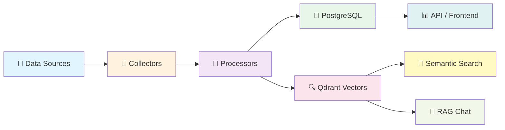

# 🏗 Architecture

## System Overview

```
┌────────────────────────────────────────────────────────────────────────┐
│                           FRONTEND (Next.js 14)                        │
│  Dashboard │ Papers │ Repos │ Search │ Trending │ Community │ AI Chat  │
└──────────────────────────────┬─────────────────────────────────────────┘
                               │ REST API
┌──────────────────────────────┴─────────────────────────────────────────┐
│                          BACKEND (FastAPI)                             │
│                                                                        │
│  ┌──────────┐  ┌───────────┐  ┌───────────┐  ┌──────────┐  ┌─────────┐│
│  │  API     │  │ Collectors│  │Processors │  │   LLM    │  │   RAG   ││
│  │ Routers  │  │           │  │           │  │  Router  │  │Pipeline ││
│  │ (15)     │  │ ArXiv     │  │Embedding  │  │          │  │         ││
│  │          │  │ GitHub    │  │Classifier │  │  Ollama  │  │Retriever││
│  │ Papers   │  │ Semantic  │  │Summarizer │  │  OpenAI  │  │Reranker ││
│  │ Repos    │  │ Scholar   │  │Entity     │  │          │  │Generator││
│  │ Search   │  │ OpenAlex  │  │Extractor  │  └──────────┘  └─────────┘│
│  │ Trending │  │ PwC       │  │PaperCode  │                           │
│  │ Chat     │  │ HF        │  │Linker     │                           │
│  │ Docs     │  │ OpenReview│  │TechRadar  │                           │
│  │ Community│  │ HN/Dev.to │  │Trending   │                           │
│  │ Reports  │  │ Mastodon  │  │Analyzer   │                           │
│  │ Auth     │  │ Lemmy     │  │           │                           │
│  │ Bookmarks│  │           │  │           │                           │
│  └──────────┘  └───────────┘  └───────────┘                           │
│                                                                        │
│  ┌─────────────────────────────────────────────────────────────────┐   │
│  │                    WORKER LAYER (Celery + Redis)                │   │
│  │  • Periodic data collection    • Embedding generation           │   │
│  │  • Citation enrichment         • Report generation              │   │
│  └─────────────────────────────────────────────────────────────────┘   │
└────────────────────────────────────────────────────────────────────────┘
                               │
        ┌──────────────────────┼──────────────────────┐
        │                      │                      │
┌───────┴──────┐  ┌────────────┴──────────┐  ┌───────┴──────┐
│  PostgreSQL  │  │     Qdrant            │  │    Redis     │
│  (Relational │  │  (Vector Database)    │  │   (Cache &   │
│   Storage)   │  │  Papers + Repos +     │  │  Task Queue) │
│              │  │  Documents embeddings │  │              │
└──────────────┘  └───────────────────────┘  └──────────────┘
```

---

## Data Pipeline



**Collection Cycle:**
1. **Celery Beat** triggers periodic collection tasks (configurable schedule)
2. **Collectors** fetch data from external APIs (ArXiv, GitHub, etc.)
3. **Processors** enrich data: classify, summarize, extract entities, compute embeddings
4. **Storage** persists structured data to PostgreSQL and vectors to Qdrant
5. **Frontend** displays collected data with real-time analytics

---

## Project Structure

```
RRI/
├── 📂 frontend/                 # Next.js 14 frontend
│   ├── app/                     # App Router pages
│   │   ├── page.tsx             #   Dashboard
│   │   ├── papers/              #   Papers (overview + browse)
│   │   ├── repos/               #   Repositories
│   │   ├── search/              #   Semantic search
│   │   ├── trending/            #   Trending analytics
│   │   ├── huggingface/         #   HuggingFace models
│   │   ├── community/           #   Community posts
│   │   ├── openreview/          #   OpenReview papers
│   │   ├── chat/                #   AI Chat (RAG)
│   │   ├── my-library/          #   Personal library
│   │   ├── reports/             #   Weekly reports
│   │   ├── login/ & register/   #   Authentication
│   │   └── layout.tsx           #   Root layout + TopNav
│   ├── components/              # Reusable components
│   │   ├── layout/TopNav.tsx    #   Navigation bar
│   │   ├── AuthProvider.tsx     #   Auth context
│   │   ├── ThemeProvider.tsx    #   Dark/Light theme
│   │   ├── BookmarkDialog.tsx   #   Bookmark modal
│   │   ├── FileViewerModal.tsx  #   Document viewer
│   │   ├── charts/              #   Chart components
│   │   └── chat/                #   Chat UI components
│   └── lib/                     # API client & utilities
│
├── 📂 src/                      # Python backend
│   ├── main.py                  # FastAPI app factory
│   ├── cli/                     # CLI tool (rri command)
│   │   ├── main.py              #   Typer app entry point
│   │   ├── _async.py            #   Async runner helper
│   │   ├── _context.py          #   Dependency factories
│   │   ├── _output.py           #   Rich formatting & file writers
│   │   └── commands/            #   Command implementations
│   │       ├── collect.py       #     rri collect (arxiv/openalex/hf/repo)
│   │       ├── search.py        #     rri search (papers/vector/repos)
│   │       ├── analyze.py       #     rri analyze (paper/batch)
│   │       ├── export.py        #     rri export (report/papers)
│   │       └── chat.py          #     rri chat (interactive RAG)
│   ├── api/                     # API layer
│   │   ├── routers/             #   15 route modules
│   │   ├── schemas/             #   Pydantic models
│   │   └── deps.py              #   Dependencies (auth, db)
│   ├── collectors/              # Data source collectors
│   │   ├── arxiv.py             #   ArXiv API
│   │   ├── github.py            #   GitHub API
│   │   ├── semantic_scholar.py  #   Semantic Scholar API
│   │   ├── openalex.py          #   OpenAlex API
│   │   ├── papers_with_code.py  #   Papers With Code
│   │   ├── huggingface.py       #   HuggingFace API
│   │   └── vietnam/             #   Vietnamese journal sources
│   ├── processors/              # NLP processing
│   │   ├── embedding.py         #   BGE embedding generation
│   │   ├── classifier.py        #   Paper classification
│   │   ├── summarizer.py        #   Text summarization
│   │   ├── entity_extractor.py  #   Named entity extraction
│   │   ├── paper_code_linker.py #   Paper↔Code matching
│   │   ├── tech_analyzer.py     #   Technology analysis
│   │   └── trending.py          #   Trend computation
│   ├── llm/                     # LLM integration
│   │   ├── router.py            #   LLM router (local/cloud)
│   │   ├── ollama_client.py     #   Ollama client
│   │   ├── openai_client.py     #   OpenAI client
│   │   └── prompts/             #   Prompt templates
│   ├── rag/                     # RAG pipeline
│   │   ├── pipeline.py          #   Main RAG orchestrator
│   │   ├── retriever.py         #   Vector retrieval
│   │   ├── reranker.py          #   Result reranking
│   │   └── generator.py         #   Answer generation
│   ├── services/                # Business logic
│   │   ├── paper_service.py     #   Paper operations
│   │   ├── repo_service.py      #   Repository operations
│   │   ├── repo_ingestion.py    #   GitHub repo ingestion
│   │   ├── text_extractor.py    #   PDF/DOCX/PPTX extraction
│   │   ├── trending_service.py  #   Trending computations
│   │   ├── export_service.py    #   Data export
│   │   └── *_service.py         #   Platform-specific services
│   ├── storage/                 # Data layer
│   │   ├── database.py          #   AsyncSession factory
│   │   ├── models/              #   20+ SQLAlchemy models
│   │   ├── repositories/        #   Repository pattern DAOs
│   │   ├── cache/               #   Redis caching
│   │   └── vector/              #   Qdrant vector store
│   └── workers/                 # Background tasks
│       ├── celery_app.py        #   Celery configuration
│       └── tasks/               #   Periodic & on-demand tasks
│
├── 📂 migrations/               # Alembic migrations
├── 📂 scripts/                  # Utility scripts
│   ├── seed_data.py             #   Demo data seeder
│   ├── index_all.py             #   Bulk vector indexing
│   └── tunnel.sh                #   Cloudflare tunnel setup
├── 📂 tests/                    # Test suite
│
├── docker-compose.yml           # 8-service orchestration
├── Dockerfile                   # Backend container
├── Makefile                     # Dev commands
├── pyproject.toml               # Python dependencies
└── .env.example                 # Environment template
```

---

## Key Design Decisions

| Decision | Rationale |
|:---------|:----------|
| **Async everywhere** | FastAPI + SQLAlchemy async for high concurrency |
| **Celery for workers** | Separates long-running data collection from API responses |
| **Qdrant for vectors** | Purpose-built vector DB, better performance than pgvector for large-scale similarity search |
| **Dual LLM strategy** | Ollama (local, private, free) + OpenAI (powerful, cloud) gives flexibility |
| **Repository pattern** | Clean separation between API layer and data access |
| **Docker Compose** | Single-command deployment for all 8 services |
